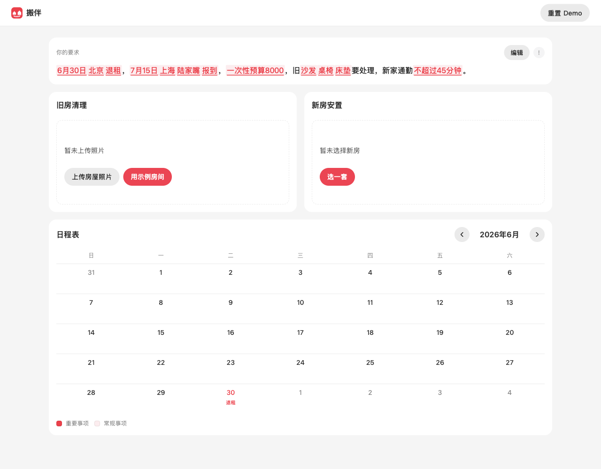
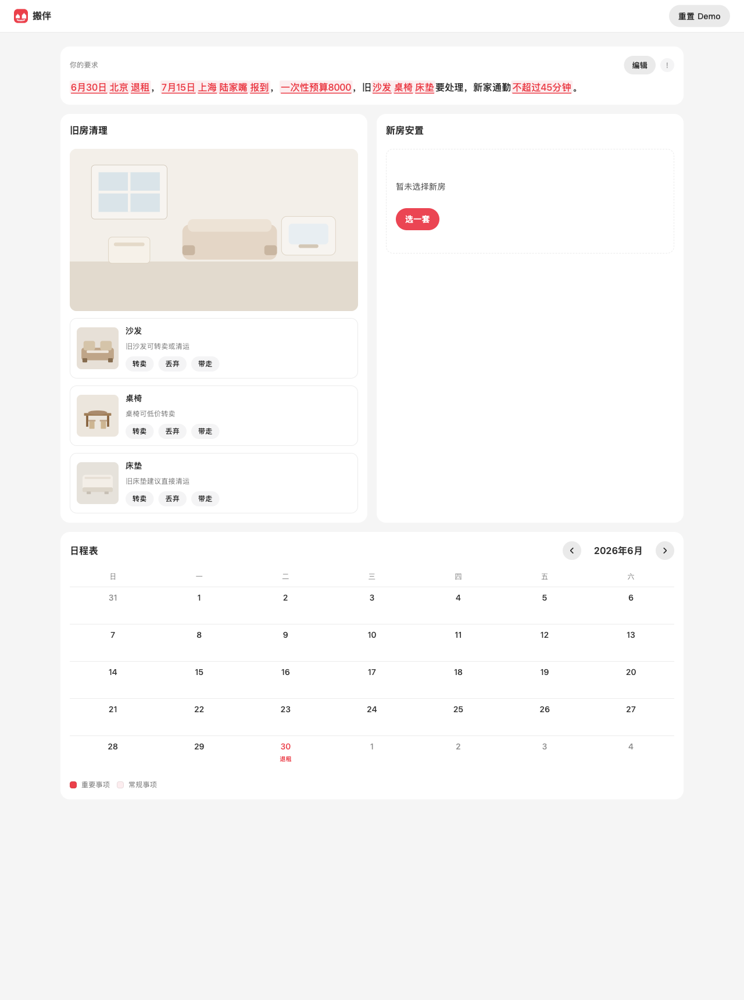
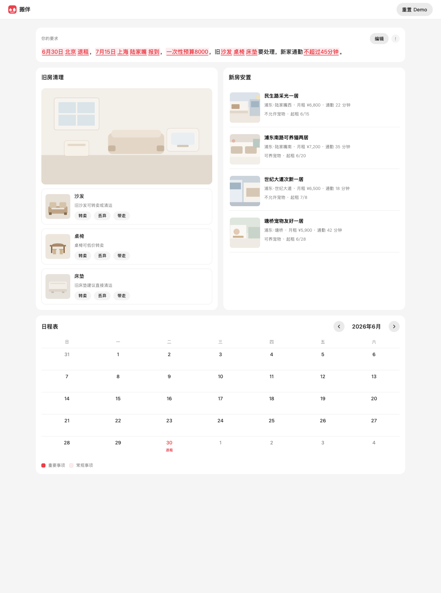
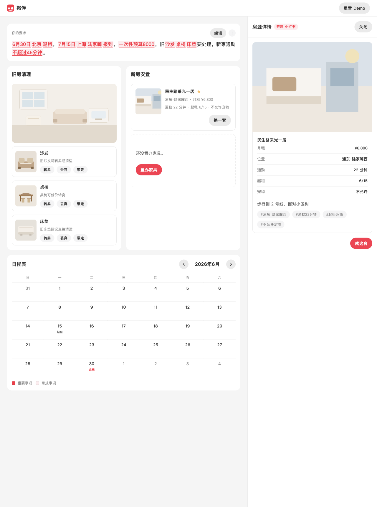
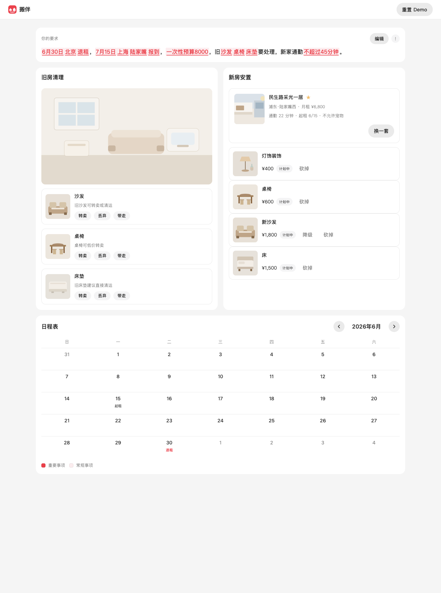

# 作品申报文案

## 作品名称（10字以内）

搬伴

## 灵感来源（100字以内）

跨城搬家要同时处理退租、旧物去留、租房和置办。信息往往不齐，退租日、报到日和预算却先定了，每改一个条件，时间和花费都要重算。

## 解决方案（100字以内）

一句话写清约束，AI 摊开整盘计划：要求被划线，旧房新房先留白。给旧房拍照，认出旧物并写出小红书转卖帖；按通勤点选房源，再补上置办。改一句要求，日程和花费一起更新。

## 最惊艳的地方（100字以内）

同一屏里旧房、新房、月历一起在，缺的留白等你补，点一下才长出来。原句上的日期、预算和旧物划成红字。再改一句要求，划线、花费和月历当天一起重写。

## 关键效果截图

按现在的界面重拍 6 张（每张 10M 以内），原图在 `docs/screenshots/`。

**1. 启动：一句话说清约束**

**2. 生成后整盘摊开，要求划线，旧房新房先留白**

**3. 旧房拍照，认出沙发、桌椅、床垫**

**4. 点「选一套」，按通勤列出房源**

**5. 房源详情来自小红书，字段按列表展示**

**6. 选定新房并置办，日程标上起租和退租**

## 下一步计划（100字以内）

眼下是可点的纯前端 Demo。下一步跟一次真实跨城搬家，把拍照出帖、筛房和置办做成闭环，再把同一套「先摊开、缺了留白、一改就重算」用到换城市、换工作。
